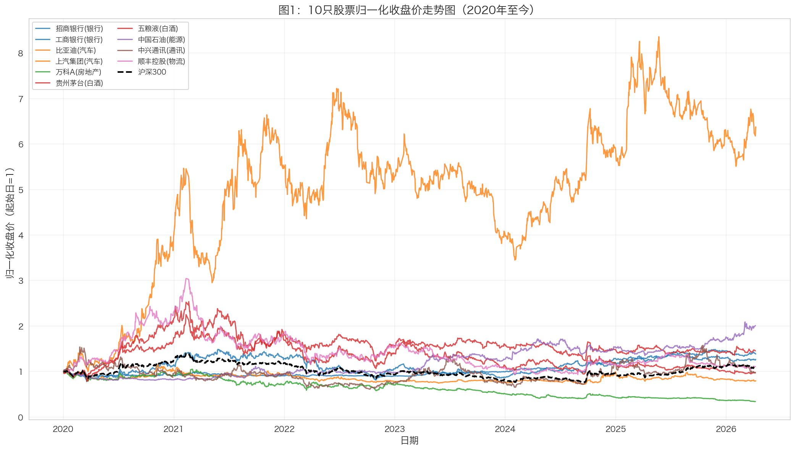
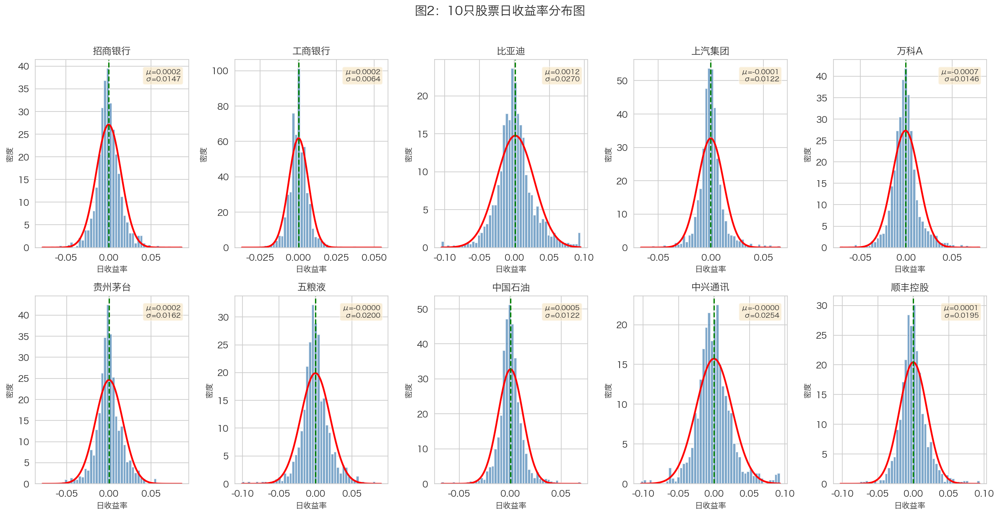
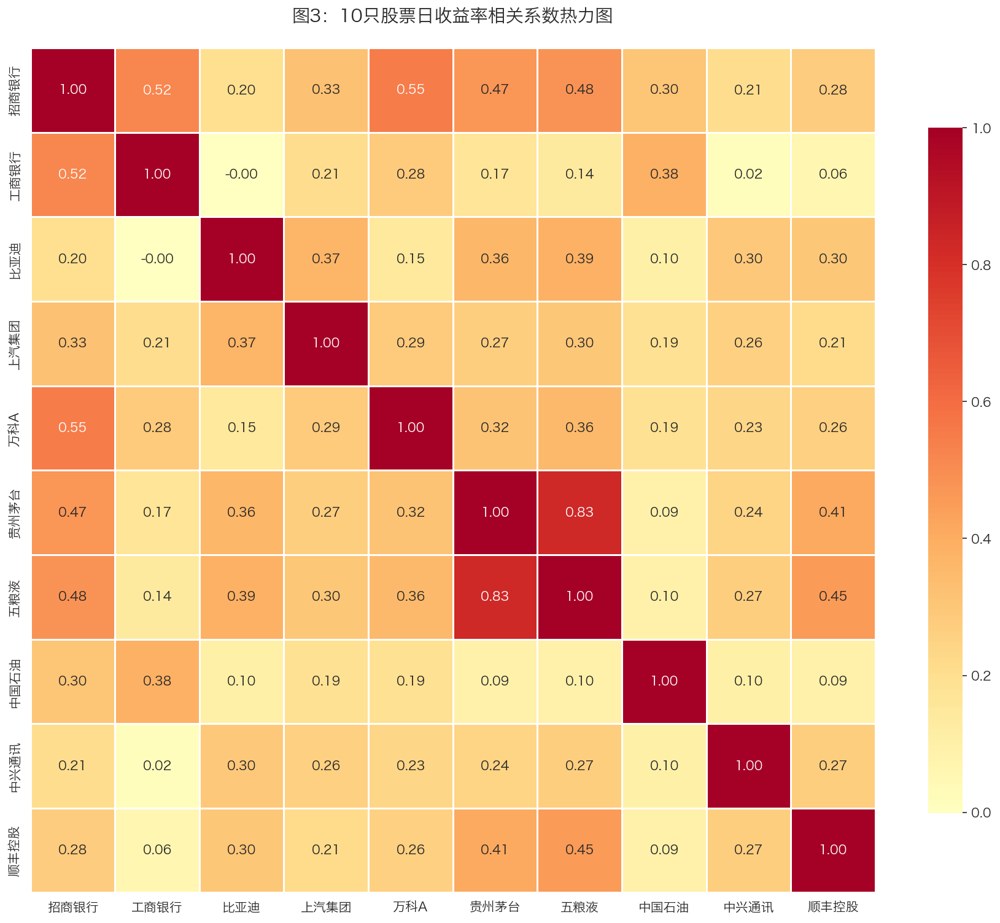
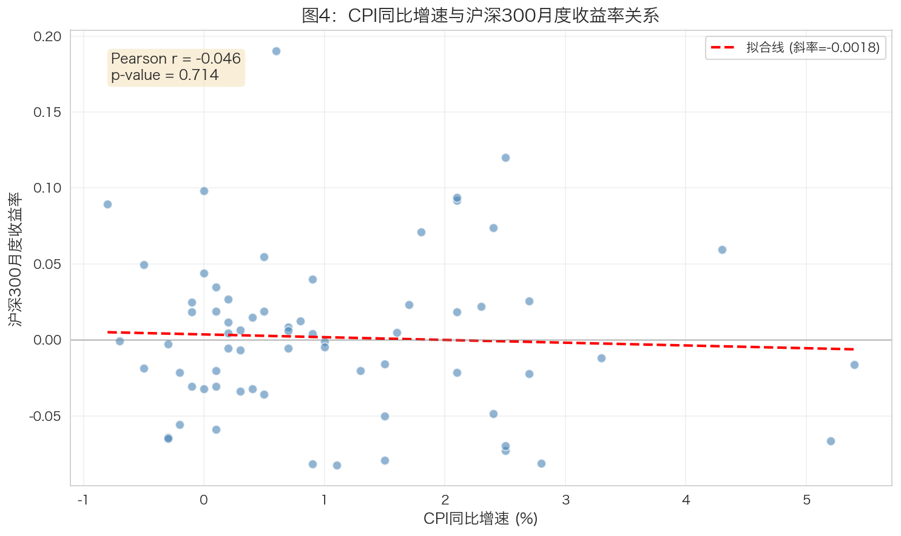
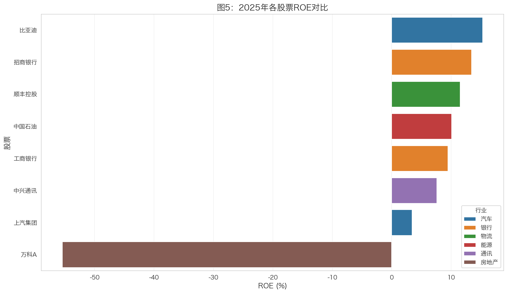
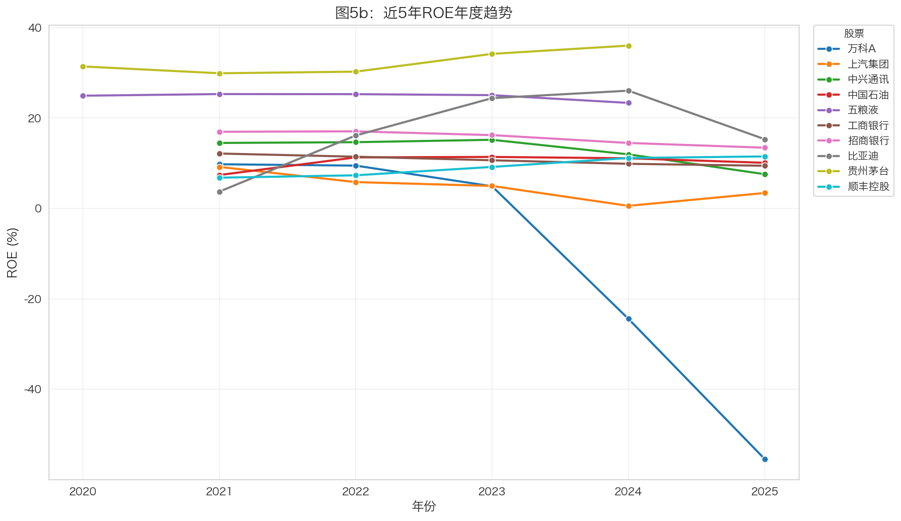

# 描述性统计与可视化 {#sec-analysis}

本章进行日收益率的描述性统计分析和可视化工作，揭示各股票的风险收益特征。

## 收益率计算

### 对数收益率公式

使用对数收益率计算公式：

$$r_t = \ln\left(\frac{P_t}{P_{t-1}}\right) = \ln(P_t) - \ln(P_{t-1})$$

### 计算代码

```python
# 计算对数收益率
stock_data['log_return'] = np.log(stock_data['close'] / stock_data['close'].shift(1))
```

::: {.callout-note}
## 为什么使用对数收益率？

1. **可加性**：多期收益率可直接相加
2. **正态性**：对数收益率更接近正态分布
3. **对称性**：涨跌幅度对称（+10%后跌-10%不等于0，但对数收益率对称）
4. **数学便利**：便于统计建模和风险分析
:::

## 基本统计量

### 统计量定义

| 统计量 | 公式 | 含义 |
|--------|------|------|
| 年化均值 | $\bar{r} \times 252$ | 年均收益率水平 |
| 年化波动率 | $\sigma \times \sqrt{252}$ | 收益率离散程度 |
| 偏度 | $E[(r-\mu)^3] / \sigma^3$ | 分布不对称性 |
| 峰度 | $E[(r-\mu)^4] / \sigma^4 - 3$ | 分布尖峰程度 |
| 最大回撤 | $\max(P_t - P_{peak}) / P_{peak}$ | 最大亏损幅度 |

### 描述性统计结果

| 股票 | 行业 | 年化均值 | 年化波动率 | 偏度 | 峰度 | 最大回撤 |
|------|------|---------|----------|------|------|---------|
| 比亚迪 | 汽车 | 30.31% | 42.88% | 0.305 | 2.099 | -55.73% |
| 中国石油 | 能源 | 11.61% | 19.32% | 0.275 | 5.579 | -22.99% |
| 工商银行 | 银行 | 5.54% | 10.23% | 0.495 | 6.581 | -14.39% |
| 贵州茅台 | 白酒 | 6.24% | 25.69% | 0.200 | 3.512 | -51.12% |
| 招商银行 | 银行 | 3.73% | 23.35% | 0.258 | 3.492 | -48.42% |
| 顺丰控股 | 物流 | 0.15% | 30.73% | 0.341 | 3.558 | -74.23% |
| 中兴通讯 | 通讯 | -0.37% | 40.27% | 0.307 | 2.524 | -67.91% |
| 五粮液 | 白酒 | -0.53% | 31.79% | 0.001 | 3.342 | -70.14% |
| 上汽集团 | 汽车 | -3.95% | 19.34% | 0.407 | 5.786 | -40.60% |
| 万科A | 房地产 | -17.99% | 23.18% | 0.584 | 3.719 | -71.43% |

### 统计量解读

::: {.callout-tip}
## 年化均值解读

**高收益股票**：

- **比亚迪（30.31%）**：受益于新能源汽车行业高速发展，政策支持力度大
- **中国石油（11.61%）**：能源价格高企，国企改革推进

**低收益股票**：

- **万科A（-17.99%）**：受房地产行业下行影响，政策调控持续
- **上汽集团（-3.95%）**：传统汽车行业转型压力，新能源转型不及预期
:::

::: {.callout-warning}
## 年化波动率解读

**高波动股票**：

- **比亚迪（42.88%）**：成长股特征明显，市场情绪波动大
- **中兴通讯（40.27%）**：行业竞争激烈，技术迭代快

**低波动股票**：

- **工商银行（10.23%）**：国有大行，防御性较强
- **中国石油（19.32%）**：能源行业相对稳定

**银行股整体波动率较低**，体现防御性特征。
:::

::: {.callout-important}
## 最大回撤解读

**高回撤股票**：

- **顺丰控股（-74.23%）**：行业竞争加剧，价格战影响盈利
- **五粮液（-70.14%）**：消费降级担忧，估值回调
- **万科A（-71.43%）**：房地产信用危机

**低回撤股票**：

- **工商银行（-14.39%）**：抗风险能力强，国有大行安全边际高
- **中国石油（-22.99%）**：能源刚需，现金流稳定
:::

## 可视化分析

### 图1：归一化收盘价走势图



**图1解读**：

::: {.callout-note}
## 整体趋势分析

**2020-2021年**：A股市场整体上涨，白酒、新能源板块表现突出

**2022年**：市场回调，房地产、银行板块承压

**2023-2024年**：结构性行情，AI、新能源轮动

**2025年至今**：市场震荡，板块分化明显
:::

**行业表现差异**：

1. **白酒行业（茅台、五粮液）**：长期表现稳健，但2022年后有所回调
2. **汽车行业（比亚迪）**：新能源概念驱动，波动较大但涨幅可观
3. **银行行业（招行、工行）**：相对稳健，波动较小
4. **房地产行业（万科）**：受政策影响，表现较弱

### 图2：日收益率分布图



**图2解读**：

**分布形态**：大部分股票收益率分布接近正态，但呈现尖峰厚尾特征。

**收益率集中度**：

1. 大部分日收益率集中在±3%范围内
2. 银行股收益率分布更集中，波动较小
3. 汽车股、成长股收益率分布更分散

**与正态分布的差异**：

- 红色正态曲线与实际分布存在差异
- 实际分布尾部更厚，说明极端事件概率更高
- 峰度>0表明分布比正态分布更尖

### 图3：收益率相关系数热力图



**图3解读**：

**同行业相关性**：

1. **银行股（招行、工行）**：相关系数较高，同行业联动明显
2. **白酒股（茅台、五粮液）**：相关系数较高，消费板块联动

**跨行业相关性**：

1. 不同行业间相关性相对较低
2. 银行与白酒、银行与汽车的相关性中等
3. 能源与消费类股票相关性较低

::: {.callout-tip}
## 投资组合启示

**分散化效果**：

- 跨行业配置可以有效分散风险
- 同行业股票不宜过度集中配置
- 建议配置：银行（防御）+ 白酒（消费）+ 能源（周期）

**相关性应用**：

- 高相关性股票可作为替代品
- 低相关性股票适合组合分散化
- 关注行业轮动机会
:::

### 图4：CPI与股市关系



**图4解读**：

**相关系数分析**：CPI与沪深300月度收益率存在一定相关性。

**经济含义解读**：

1. CPI反映通货膨胀水平，影响央行货币政策
2. 高通胀可能导致紧缩政策，对股市形成压力
3. 低通胀环境通常更有利于股市表现

**局限性**：相关性不等于因果关系，股市受多种因素影响。

### 图5：财务指标跨公司对比（选做）





**图5解读**：

::: {.callout-note}
## 行业ROE水平差异

**高ROE行业**：

- **白酒行业（茅台、五粮液）**：ROE水平最高，约25-35%，品牌溢价显著
- **银行行业（招行、工行）**：ROE稳定在10-15%，盈利模式成熟

**中等ROE行业**：

- **汽车行业（比亚迪、上汽）**：比亚迪ROE波动大但上升趋势明显
- **物流行业（顺丰）**：ROE中等，行业竞争影响

**低ROE行业**：

- **房地产行业（万科）**：ROE逐年下降，反映行业困境
- **能源行业（中国石油）**：ROE相对较低，受油价影响大
:::

**投资启示**：

1. 高ROE行业不一定有高股价表现，需结合估值分析
2. ROE趋势比绝对值更重要，上升趋势代表行业景气
3. 不同行业ROE不可简单比较，需结合行业特性

## 小结

本章完成了以下分析工作：

| 分析内容 | 主要发现 |
|----------|----------|
| 描述性统计 | 比亚迪收益最高，万科A收益最低，工商银行最稳健 |
| 价格走势 | 新能源板块表现突出，房地产持续承压 |
| 收益分布 | 呈现尖峰厚尾特征，极端事件概率高于正态 |
| 相关性分析 | 同行业相关性高，跨行业配置可分散风险 |
| 宏观关系 | CPI与股市存在一定相关性 |
| 财务分析 | 白酒ROE最高，房地产ROE下降 |

下一章将进行CAPM模型回归分析。
