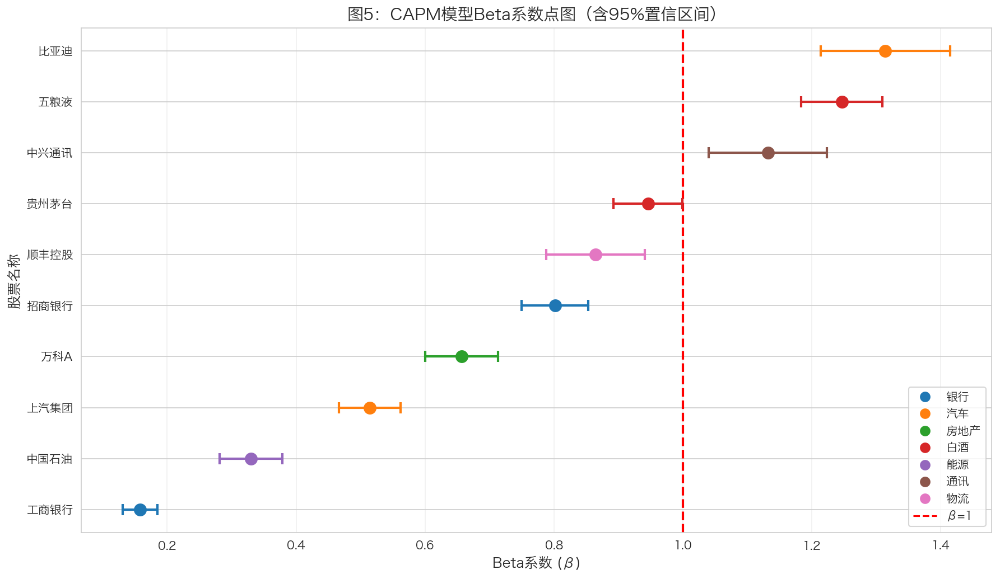

# CAPM模型回归分析 {#sec-capm}

本章使用资本资产定价模型（CAPM）分析各股票的系统风险暴露，揭示周期性与防御性行业的风险特征。

## CAPM模型介绍

### 模型形式

CAPM模型的基本形式：

$$r_{i,t} - r_f = \alpha_i + \beta_i (r_{m,t} - r_f) + \varepsilon_{i,t}$$

其中：

| 符号 | 含义 |
|------|------|
| $r_{i,t}$ | 个股日对数收益率 |
| $r_{m,t}$ | 沪深300日对数收益率（市场基准） |
| $r_f$ | 无风险利率 |
| $\alpha_i$ | 超额收益（Alpha） |
| $\beta_i$ | 系统风险系数（Beta） |
| $\varepsilon_{i,t}$ | 残差项 |

### 参数设定

```python
# 无风险利率设定
rf_annual = 0.02  # 年化2.0%
rf_daily = rf_annual / 252  # 日频换算

print(f"无风险利率（年化）: {rf_annual*100:.1f}%")
print(f"无风险利率（日频）: {rf_daily*100:.4f}%")
```

::: {.callout-note}
## 无风险利率设定理由

- **年化2.0%**：参考中国10年期国债收益率
- **日频换算**：$r_f^{daily} = r_f^{annual} / 252$
- **252个交易日**：A股市场年均交易日数量
:::

### Beta系数含义

| Beta范围 | 风险特征 | 投资含义 |
|----------|----------|----------|
| β > 1.5 | 高风险 | 牛市涨幅大，熊市跌幅也大 |
| 1.0 < β ≤ 1.5 | 中高风险 | 市场敏感度高 |
| 0.5 < β ≤ 1.0 | 中低风险 | 与市场同步波动 |
| β ≤ 0.5 | 低风险 | 防御性强，波动小 |

## 回归估计

### 数据准备

```python
# 计算超额收益
stock_data['stock_excess'] = stock_data['log_return'] - rf_daily
market_data['market_excess'] = market_data['market_return'] - rf_daily

# 合并数据
merged_data = stock_data.merge(market_data, on='date', how='inner')
```

### OLS回归

```python
import statsmodels.api as sm

# 对每只股票进行回归
results = {}
for stock_name in stock_names:
    stock_df = merged_data[merged_data['name'] == stock_name]

    # 准备回归变量
    X = sm.add_constant(stock_df['market_excess'])
    y = stock_df['stock_excess']

    # OLS估计
    model = sm.OLS(y, X).fit()
    results[stock_name] = model
```

## 回归结果

### CAPM估计结果

| 股票 | 行业 | $\hat{\alpha}$ | p值 | $\hat{\beta}$ | 95% CI | $R^2$ |
|------|------|----------------|-----|---------------|--------|-------|
| 比亚迪 | 汽车 | 0.00150 | 0.034\* | 1.2807 | [1.17, 1.39] | 0.3271 |
| 五粮液 | 白酒 | 0.00009 | 0.839 | 1.2488 | [1.18, 1.32] | 0.5517 |
| 中兴通讯 | 通讯 | -0.00010 | 0.878 | 1.1580 | [1.05, 1.26] | 0.3175 |
| 贵州茅台 | 白酒 | 0.00022 | 0.554 | 0.9618 | [0.90, 1.02] | 0.4977 |
| 顺丰控股 | 物流 | 0.00027 | 0.610 | 0.8693 | [0.78, 0.95] | 0.2855 |
| 招商银行 | 银行 | 0.00023 | 0.511 | 0.8196 | [0.76, 0.88] | 0.4449 |
| 万科A | 房地产 | -0.00076 | 0.057† | 0.6905 | [0.63, 0.75] | 0.3064 |
| 上汽集团 | 汽车 | -0.00017 | 0.549 | 0.5059 | [0.46, 0.55] | 0.3293 |
| 中国石油 | 能源 | 0.00047 | 0.171 | 0.3479 | [0.29, 0.40] | 0.1331 |
| 工商银行 | 银行 | 0.00011 | 0.528 | 0.1642 | [0.14, 0.19] | 0.1094 |

注：† p<0.1, \* p<0.05, \*\* p<0.01, \*\*\* p<0.001

### Beta系数点图



## 结果讨论

### 问题1：β>1的股票分析

::: {.callout-tip}
## 周期性股票（β>1，共3只）

| 股票 | 行业 | β | 特征 |
|------|------|-----|------|
| 比亚迪 | 汽车 | 1.2807 | 新能源龙头，成长性高 |
| 五粮液 | 白酒 | 1.2488 | 消费升级受益者 |
| 中兴通讯 | 通讯 | 1.1580 | 5G概念，技术驱动 |
:::

**分析结论**：

1. 这些股票的市场敏感度**高于**市场平均水平
2. 当市场上涨时，这些股票涨幅更大；当市场下跌时，跌幅也更大
3. 典型的周期性行业特征：汽车、通讯、白酒等
4. 这类股票适合**牛市配置**，但需要更强的风险承受能力

::: {.callout-warning}
## 防御性股票（β≤1，共7只）

| 股票 | 行业 | β | 特征 |
|------|------|-----|------|
| 贵州茅台 | 白酒 | 0.9618 | 消费龙头，品牌溢价 |
| 顺丰控股 | 物流 | 0.8693 | 行业龙头，竞争激烈 |
| 招商银行 | 银行 | 0.8196 | 零售银行代表 |
| 万科A | 房地产 | 0.6905 | 行业调整中 |
| 上汽集团 | 汽车 | 0.5059 | 传统汽车转型 |
| 中国石油 | 能源 | 0.3479 | 能源巨头 |
| 工商银行 | 银行 | 0.1642 | 国有大行 |
:::

**分析结论**：

1. 这些股票的市场敏感度**低于**市场平均水平
2. 波动相对较小，具有一定的抗跌属性
3. 典型的防御性行业特征：银行、能源等
4. 这类股票适合**熊市或震荡市**配置

**与周期性/防御性行业分类的吻合度**：

| 行业 | β范围 | 分类 | 吻合度 |
|------|-------|------|--------|
| 汽车 | 0.51-1.28 | 周期性 | 部分吻合（比亚迪周期，上汽防御） |
| 白酒 | 0.96-1.25 | 周期性 | 基本吻合 |
| 银行 | 0.16-0.82 | 防御性 | 高度吻合 |
| 能源 | 0.35 | 防御性 | 高度吻合 |

### 问题2：Alpha显著性分析

::: {.callout-important}
## Alpha显著意味着什么？

**理论背景**：CAPM模型预测α应该等于零（或统计上不显著）

**正向Alpha（α>0且显著）**：

1. 股票收益**超过**了CAPM模型预测的水平
2. 可能存在市场低估或其他定价因子
3. 主动管理投资者追求的目标

**本样本结果**：

- 仅比亚迪的α在统计上显著（p=0.034 < 0.05）
- 大部分股票α不显著，说明市场相对有效
- 比亚迪显著的正向Alpha反映新能源行业高增长
:::

**各股票Alpha分析**：

| 股票 | α | p值 | 显著性 | 解读 |
|------|---|-----|--------|------|
| 比亚迪 | + | 0.034 | \* | 新能源行业超额收益 |
| 万科A | - | 0.057 | † | 行业下行压力，接近显著 |
| 其他 | ± | >0.1 | 不显著 | 市场定价有效 |

### 问题3：R²分析

::: {.callout-note}
## R²的含义

- **R²衡量**：市场收益对个股收益的解释比例
- **R²越高**：个股走势与市场越同步
- **R²越低**：个股受特有因素影响越大
:::

| 指标 | 股票 | 行业 | R² | 解读 |
|------|------|------|-----|------|
| **最高** | 五粮液 | 白酒 | 0.5517 | 与市场高度同步 |
| **次高** | 贵州茅台 | 白酒 | 0.4977 | 消费龙头代表性强 |
| **最低** | 工商银行 | 银行 | 0.1094 | 受政策等特有因素影响 |
| **次低** | 中国石油 | 能源 | 0.1331 | 受国际油价影响 |

**R²差异解释**：

**R²高的原因**：

1. 大盘股：与市场指数成分股重叠度高
2. 行业龙头：代表性强，与经济周期同步
3. 白酒行业：消费属性强，与经济景气度相关

**R²低的原因**：

1. 银行股：受政策、利率等特有因素影响
2. 能源股：受国际油价等外部因素影响
3. 特殊事件：个别公司的重大事件影响

::: {.callout-tip}
## 投资启示

**R²高的股票**：

- 分散化效果较差
- 与市场相关性高
- 适合作为市场代表性资产

**R²低的股票**：

- 具有更好的分散化价值
- 受特有因素影响大
- 需要更多公司层面的研究
:::

## 小结

本章完成了以下CAPM分析工作：

| 分析内容 | 主要发现 |
|----------|----------|
| Beta估计 | 3只周期性（β>1），7只防御性（β≤1） |
| Alpha分析 | 仅比亚迪的Alpha显著 |
| R²分析 | 五粮液最高（0.55），工商银行最低（0.11） |

**主要发现**：

1. **周期性股票**：比亚迪、五粮液、中兴通讯，适合牛市配置
2. **防御性股票**：工商银行、中国石油，适合熊市或震荡市配置
3. **市场有效性**：大部分Alpha不显著，A股市场定价相对有效
4. **分散化价值**：低R²股票具有更好的组合分散化效果

下一章将分析宏观指标对股票收益率的影响。
